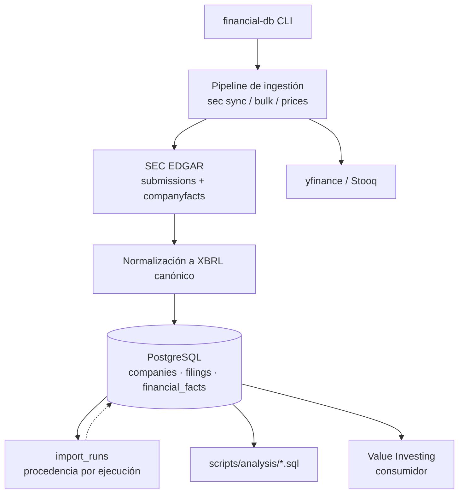

# Base de Datos Financiera

Ingesta de datos de la SEC EDGAR (company facts, filings, submissions) en
PostgreSQL, con procedencia auditable y scripts SQL de análisis reutilizables.
Base de datos de [Value Investing](https://github.com/JdeJusto/Value_Investing),
que consume sus fundamentales.

> Documentación en inglés, comentarios y mensajes del pipeline en español: es
> lo que hay hoy y no se cambia en este commit.

## Características

- Esquema normalizado para datos financieros
- Soporte para varios proveedores de datos
- Seguimiento de procedencia completo con identificadores de origen
- Rastreo de auditoría para todas las operaciones de importación
- Diseño flexible para acomodar varios tipos de datos financieros
- Índices para patrones de consulta comunes
- **Pipeline de ingestión SEC EDGAR** - Importación de datos de producción
- **Pipeline de ingestión de precios de acciones** - Importación de precios históricos desde Stooq

## Descripción General del Esquema

La base de datos consta de las siguientes tablas principales:

- `companies` - Información básica de empresas
- `company_identifiers` - Varios identificadores de empresas (CIK, FIGI, etc.)
- `company_listings` - Cotizaciones en bolsa de las empresas
- `exchanges` - Bolsas de valores
- `data_providers` - Fuentes de datos financieros
- `filings` - Presentaciones regulatorias SEC y documentos similares
- `financial_facts` - Datos financieros normalizados de estados financieros
- `prices` - Datos históricos de precios y volúmenes
- `dividends` - Déclaraciones y pagos de dividendos
- `splits` - Eventos de división de acciones
- `raw_documents` - Metadatos de archivos de datos raw preservados
- `import_runs` - Registro de auditoría para operaciones de importación

## Empezando

### Prerrequisitos

- PostgreSQL 14+ (probado con 18)
- Python 3.13+ (ver `requires-python` en `pyproject.toml`)

### Instalación

1. Clonar el repositorio
2. Copiar `.env.example` a `.env` y configurar la conexión a la base de datos
   (`.env` está en `.gitignore`: no se versiona nunca)
3. Instalar el paquete y sus dependencias de desarrollo:
   ```bash
   python -m venv .venv && source .venv/bin/activate
   pip install -e ".[dev]"
   ```
4. Ejecutar las migraciones de base de datos:
   ```bash
   python -m financial_database.cli migrate
   ```
   Usa el runner, **no** `psql -f`: el runner registra cada migración en
   `schema_migrations` y una aplicación manual se volvería a intentar (y
   fallaría) en la siguiente ejecución.
5. Ejecutar la suite unitaria (no necesita base de datos):
   ```bash
   python -m pytest tests/unit -q
   ```

### Ingestión en 30 segundos

```bash
# 1. companyfacts de una empresa (una sola, por CIK)
SEC_USER_AGENT="TuHerramienta/1.0 tu@email.com" \
  python -m financial_database.cli sec sync 0000320193

# 2. ¿qué se ingirió?
psql "$DATABASE_URL" -c "
  SELECT r.pipeline, r.status, c.legal_name, r.records_inserted,
         r.records_skipped, r.duration_seconds
  FROM import_runs r LEFT JOIN companies c ON c.id = r.company_id
  ORDER BY r.started_at DESC LIMIT 5;"
```


### Configuración SEC EDGAR

Para usar el pipeline de ingestión SEC, debe configurar un User-Agent según lo requiera la SEC:

1. Editar `.env` y configurar `SEC_USER_AGENT`:
   ```
   SEC_USER_AGENT=tu-aplicacion/1.0 contacto@tudominio.com
   ```
   La SEC exige un User-Agent único y descriptivo con información de contacto.

2. Configurar el almacenamiento de datos raw (opcional):
   ```
   DATA_RAW_DIR=./data/raw
   ```
   Las respuestas SEC raw se guardan aquí para procedencia y re-procesamiento.

## Ingestión SEC EDGAR

El CLI `financial-db` provee comandos de ingestión SEC:

```bash
# Semilla de proveedor y bolsas SEC
financial-db sec seed-provider
financial-db sec seed-exchanges

# Importar universo de empresas (tickers, CIK, exchanges)
financial-db sec universe

# Importar presentaciones para una empresa específica (por CIK)
financial-db sec submissions 0000320193

# Importar hechos XBRL (CompanyFacts) para una empresa específica
financial-db sec companyfacts 0000320193

# Sincronización completa para una sola empresa
financial-db sec sync 0000320193

# Ejecutar cualquier comando en modo seco (preview sin escribir)
financial-db sec sync 0000320193 --dry-run
```

**Importaciones dirigidas** (p. ej., `--cik 0000320193`) son el flujo de trabajo principal. La sincronización del universo completo (`financial-db sec sync-all --confirm`) está disponible pero implica miles de solicitudes HTTP.

### Ingestión Bulk Histórica (Fase 3.5/3.6/3.6.9)

Para cargar el universo completo SEC EDGAR desde ingestion based en API:

```bash
# Ejecutar dry-run para validar la configuración
financial-db sec bulk-ingest --dry-run

# Ingestión bulk completa (based en API, procesa todas las empresas)
financial-db sec bulk-ingest --confirm

# Procesar con límite para testing
financial-db sec bulk-ingest --limit 100 --confirm

# Reanudar desde checkpoint después de una interrupción
financial-db sec bulk-ingest --checkpoint-file ./data/checkpoints/sec_bulk/full_universe_checkpoint.json --confirm
```

**Opciones de ingestión bulk:**
| Opción | Descripción |
|--------|-------------|
| `--limit N` | Procesar solo las primeras N empresas |
| `--checkpoint-file` | Archivo de checkpoint para reanudabilidad |
| `--dry-run` | Validar sin escribir en la base de datos |
| `--verbose` | Registro detallado |
| `--confirm` | Requerido para ejecuciones completas |
| `--api-mode` | Usar SEC API para ingestion (por defecto) |

**Características:**
- **Efficient en memoria**: Parser JSON streaming (ijson) para respuestas grandes
- **Checkpoint/resume**: Checkpoints atómicos guardados cada 30s o cada 500 hechos
- **Idempotent**: Volver a ejecutar produce cero duplicados
- **Historia completa**: Sin filtrado de fechas - ingesta TODOS los datos históricos desde el primer filing
- **Resiliente a redes**: Reintentos infinitos con intervalos de 10s, backoff 429/5xx/404
- **Apagado graceful**: Manejadores SIGINT/SIGTERM que guardan checkpoint y salen limpio
- **Recuperación de fallos**: Reanudar desde el último checkpoint sin duplicados
- **Inserts por lotes**: 500 hechos por transacción, mejora de desempeño 50%+
- **~56 horas** para el universo completo (~10,000 empresas)

**Rendimiento (validado):**
| Métrica | Valor (608 empresas) | Extrapolado (10,388) |
|---------|----------------------|----------------------|
| Tiempo | ~51 min | ~14.5 horas |
| Hechos insertados | ~12.3M | ~213M |
| Presentaciones insertadas | ~130K | ~2.2M |
| Tamaño de base de datos | ~10 GB | ~170–200 GB |
| Tiempo promedio/empresa | ~5.0s | ~5.0s (bounded by network) |

### Resultados de Estrés (Fase 3.8)

Se ejecutó una prueba de estrés con 608 empresas y se validó. Resultados:

- Empresas procesadas: 608 (587 insertadas, 21 actualizadas)
- Presentaciones insertadas: 129,974
- Hechos financieros insertados: 12,343,979
- Errores: 10 (todos esperados `404` para no-XBRL filers: fondos de inversión, ADRs, trusts de royalties)
- Tiempo transcurrido: ~51 minutos
- Auditoría de integridad: cero duplicados/órfanos (ver `docs/validation_report.md`)
- Cobertura histórica: principales emisores desde 2009 (ver `scripts/verify_history.sql`)

Comando para carga full universe:

```bash
SEC_USER_AGENT="TuApp/1.0 you@example.com" \
.venv/bin/python -m financial_database.cli sec bulk-ingest --confirm
```

Reanudar desde una interrupción con el mismo comando (el checkpoint es source-aware y reanuda automáticamente). Usar `--force` para restablecer el progreso y empezar desde cero.

### Ingestión de Precios de Acciones

El CLI `financial-db` provee comandos para ingestión de precios de acciones desde Yahoo Finance:

```bash
# Actualizar precios para todas las listas activas
financial-db prices update

# Actualizar precios con límite (para testing)
financial-db prices update --limit 10

# Ejecutar en modo seco (preview sin escribir)
financial-db prices update --dry-run

# Habilitar logging detallado
financial-db prices update --verbose
```

El pipeline de precios:
1. Obtiene todas las listas activas de la tabla `company_listings`
2. Para cada lista, obtiene el código de bolsa y el ticker
3. Mapea el código de bolsa a un símbolo de Yahoo Finance (ej: NASDAQ -> ticker sin sufijo)
4. Obtiene los datos de precio más recientes usando la biblioteca yfinance
5. Inserta los datos en la tabla `prices` evitando duplicados mediante restricciones únicas
6. Registra una corrida de importación para trazabilidad

#### Integración con Actualización Completa

Para ejecutar tanto la actualización SEC incremental como la de precios en un solo comando:

```bash
# Ejecutar ambas actualizaciones (SEC y precios)
financial-db update-all

# Con opciones personalizadas
financial-db update-all --sec-max-age-hours 12 --price-limit 50 --verbose
```

Esto ejecuta:
1. `financial-db sec update-incremental` (con las opciones SEC especificadas)
2. `financial-db prices update` (con las opciones de precio especificadas)

### Scripts de Análisis SQL

Se han creado scripts SQL reutilizables en el directorio `scripts/analysis/` para facilitar el análisis financiero:

1. `company_overview.sql` - Información general de una empresa por CIK
2. `financial_series.sql` - Serie temporal de métricas financieras con tasas de crecimiento y márgenes
3. `ratios_advanced.sql` - Ratios avanzados incluyendo ROE, ROA, apalancamiento y valoración
4. `compare_companies.sql` - Comparación de métricas clave entre múltiples empresas

### Salud de Mapeo Ticker→CIK

`scripts/check_ticker_health.sql` audita la integridad del mapeo ticker→CIK
después de cualquier cambio de asociación ticker→empresa. Expone las tres
clases de defecto que permitieron que XOM se resolviera a la entidad "stub"
equivocada:

1. **True stubs** — el CIK de la empresa no aparece en ninguno de sus
   accessions 10-K/10-Q/20-F/40-F propios; la fila es un stub que se tragó
   hechos reales de otro filer (firmado por un CIK distinto).
2. **Multi-CIK** — un único ticker del universo activo mapeado a dos o más
   CIK distintos (ambigüedad = riesgo de elegir el incorrecto).
3. **Zero-facts** — un ticker activo del universo cuya empresa no tiene ningún
   hecho financiero.

Cada sección imprime solo las filas infractoras; una base sana devuelve
conjuntos vacíos. Ejecutar tras cualquier modificación de carga o de mapeo:

```bash
psql "$FINANCIAL_DATABASE_URL" -f scripts/check_ticker_health.sql
```

Véase `docs/analysis_scripts.md` para documentación detallada y ejemplos de uso.

## Documentación

- [Descripción General de la Arquitectura](docs/architecture.md)
- [Detalles del Esquema de Base de Datos](docs/database.md)
- [Fuentes de Datos y Proveedores](docs/data-sources.md)
- [Instrucciones de Carga Completa](docs/runbook_full_load.md)
- [Scripts de Análisis SQL](docs/analysis_scripts.md)
- [Diagnóstico del HTTP 403 de la SEC](docs/sec_403_investigation.md) — por
  qué el `User-Agent` importa y qué devuelve la SEC
- [Barrido de datos obsoletos (2026-09-27)](docs/stale_sweep_2026-09-27.md) —
  medición real del ingestor a escala de lote
- [Bloqueo de `pg_stat_statements`](docs/pg_stat_statements_blocker.md) —
  diagnóstico y alternativas sin reinicio
- [Auditoría previa a publicar](docs/public_release_audit_2026-09-27.md)

## Arquitectura



Cada ejecución queda registrada en `import_runs` con su estado, sus
contadores y — desde la migración `0021` — la empresa concreta cuando el
pipeline es por compañía (`sec sync`, `sec_submissions`, `sec_companyfacts`).
Los pipelines por lotes dejan `company_id` a NULL a propósito.


- [Descripción General de la Arquitectura](docs/architecture.md)
- [Detalles del Esquema de Base de Datos](docs/database.md)
- [Fuentes de Datos y Proveedores](docs/data-sources.md)
- [Instrucciones de Carga Completa](docs/runbook_full_load.md)
- [Scripts de Análisis SQL](docs/analysis_scripts.md)

## Desarrollo

### Ejecutando Pruebas

```bash
# Ejecutar todas las pruebas
python -m pytest tests/

# Ejecutar pruebas con cobertura
python -m pytest tests/ --cov=src

# Ejecutar un módulo de pruebas específico
python -m pytest tests/unit/test_prices.py

# Ejecutar pruebas del proveedor SEC
python -m pytest tests/unit/test_sec_*.py
```

### Agregando Migraciones

1. Crear un nuevo archivo SQL en `db/migrations/` con el númerosequencial siguiente
2. Agregar sus sentencias DDL
3. El sistema de migraciones aplicará automáticamente las nuevas migraciones

## Directrices para Agentes de IA

Se ha creado un archivo `AGENTS.md` que proporciona directrices y información de referencia para asistentes de IA (como Claude) que trabajan en el proyecto Financial Database. Este archivo incluye:

- Visión general del proyecto y estructura de directorios
- Esquema de base de datos clave
- Tareas comunes de desarrollo
- Estándares de codificación para Python y SQL
- Directrices específicas para agentes de IA
- Consejos para solución de problemas

Nota: Este archivo está incluido en `.gitignore` para evitar que se versióne, ya que está destinado como referencia viva para asistentes de IA y puede actualizarse frecuentemente.

## Aviso Legal

Este proyecto fue desarrollado con la asistencia de herramientas de IA para debugging, detección de errores y optimización de código. Aunque se usó asistencia de IA, todo el código ha sido revisado, probado y verificado por desarrolladores humanos para asegurar corrección y calidad.

## Licencia

[MIT](LICENSE) © 2026 Jaime de Justo. Cambiar de licencia es sustituir el
fichero `LICENSE`: un commit.

## Cómo contribuir

[`CONTRIBUTING.md`](CONTRIBUTING.md). Dos reglas del proyecto: las
migraciones se aplican **con el runner** y son numeradas, y la ingestión
debe seguir siendo **idempotente** (`ON CONFLICT DO NOTHING` + `import_runs`).

## Aviso sobre datos de terceros

El repositorio incluye una instantánea de referencia de la SEC
(`company_tickers*.json`) usada para resolver tickers a CIK. Son datos
públicos de la SEC EDGAR, no datos propietarios: se incluyen por
reproducibilidad, no como fuente de verdad (la fuente es la API).